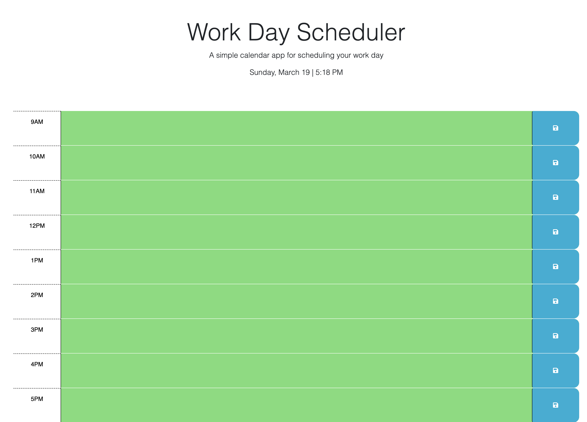

# Daily-Work-Planner

* Please note, needed to create a new repository for this challenge due to conflicts with deploying. This repository only has 1 commit which was for copying from original repository. Under the "Links" is the orginal repository for commit history.

## Description

This project we were tasked with creating a daily planner application that the user can add tasks in the text fields that will then be saved and stored in the local storage. 

How I went about completting this task was I worked in the HTML file to get the header element aligned in the center, then I created all of the div elements for the hours of 9am - 5pm.

I then started working in the JavaScript file to display the current date on the header element, then worked on creating click event for the save button.

I then made sure the elements were saved to the localStorage after the button is clicked.

Once I had those completed I worked on the function to set the color of the time blocks current hour it was on and display if the other blocks were in the 'present' or in the 'future.'

After my first submission of this challenge I then went back to polish it up and make it run properly using all of the resources I had gained since to make it a functional application.

## Links

GitHub Repo:
https://github.com/Christianmsm/Daily-Work-Planner

Original GitHub Repo:
https://github.com/Christianmsm/05-Daily-Planner

Deployed Site:
https://christianmsm.github.io/Daily-Work-Planner/

Screenshot:

## Credits

W3Schools.com
day.js.org

## License

MIT License

Copyright (c) 2023 Christianmsm

Permission is hereby granted, free of charge, to any person obtaining a copy
of this software and associated documentation files (the "Software"), to deal
in the Software without restriction, including without limitation the rights
to use, copy, modify, merge, publish, distribute, sublicense, and/or sell
copies of the Software, and to permit persons to whom the Software is
furnished to do so, subject to the following conditions:

The above copyright notice and this permission notice shall be included in all
copies or substantial portions of the Software.

THE SOFTWARE IS PROVIDED "AS IS", WITHOUT WARRANTY OF ANY KIND, EXPRESS OR
IMPLIED, INCLUDING BUT NOT LIMITED TO THE WARRANTIES OF MERCHANTABILITY,
FITNESS FOR A PARTICULAR PURPOSE AND NONINFRINGEMENT. IN NO EVENT SHALL THE
AUTHORS OR COPYRIGHT HOLDERS BE LIABLE FOR ANY CLAIM, DAMAGES OR OTHER
LIABILITY, WHETHER IN AN ACTION OF CONTRACT, TORT OR OTHERWISE, ARISING FROM,
OUT OF OR IN CONNECTION WITH THE SOFTWARE OR THE USE OR OTHER DEALINGS IN THE
SOFTWARE.

## Features

Dayjs
Bootstrap
JQurey